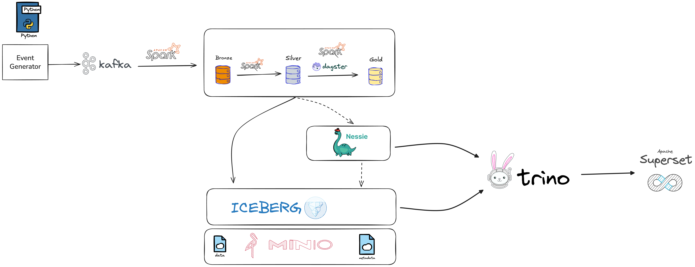

# E-Commerce Streaming Analytics Platform

A modern data lakehouse for real-time e-commerce analytics using Kafka, Spark Streaming, Apache Iceberg, and Nessie.

---

## Architecture



**Tech Stack:**  
Kafka • Spark 3.5 • Iceberg 1.4.2 • Nessie • MinIO • Trino • Dagster • Superset

---

## Prerequisites

- Docker Desktop (4.20+) with 8GB+ RAM
- Docker Compose v2.0+
- Python 3.9+

---

## Quick Setup

````bash
# 1. Clone and navigate
git clone <repo-url>
cd ecommerce-streaming-analytics

# 2. Set up environment
cp .env.example data-generation/.env

# 3. Start all services
cd local
docker compose up -d

# 4. Wait for services (2-3 min), then create Kafka topics
docker exec ecommerce-kafka kafka-topics --create \
  --bootstrap-server localhost:9092 \
  --replication-factor 1 --partitions 3 \
  --topic page-views

docker exec ecommerce-kafka kafka-topics --create \
  --bootstrap-server localhost:9092 \
  --replication-factor 1 --partitions 3 \
  --topic purchases

docker exec ecommerce-kafka kafka-topics --create \
  --bootstrap-server localhost:9092 \
  --replication-factor 1 --partitions 3 \
  --topic order-events

docker exec ecommerce-kafka kafka-topics --create \
  --bootstrap-server localhost:9092 \
  --replication-factor 1 --partitions 3 \
  --topic user-sessions

docker exec ecommerce-kafka kafka-topics --create \
  --bootstrap-server localhost:9092 \
  --replication-factor 1 --partitions 3 \
  --topic product-updates

### Generate Events

```bash
# Batch mode (5000 events)
cd data-generation
./generate_sample_data.sh 5000 0.1

# Continuous mode (until Ctrl+C)
./generate_sample_data.sh 1000 0.05 true
````

### Start Streaming Job

```bash
cd streaming/spark-streaming
./run_streaming.sh
```

**What it does:**

- Reads from Kafka topics (page-views, purchases, order-events, user-sessions, product-updates)
- Writes to Bronze layer (`iceberg.bronze.raw_events`)
- Transforms to Silver layer (`iceberg.silver.*` tables)
- Uses Iceberg + Nessie for versioned catalog

### Run Batch Analytics

Access Dagster UI at http://localhost:3000 and materialize assets:

- `daily_customer_analytics` - Customer behavior aggregations
- `daily_sales_summary` - Revenue and sales metrics
- `product_performance_analytics` - Product insights

---

## Service Access

| Service      | URL                   | Credentials             |
| ------------ | --------------------- | ----------------------- |
| **Dagster**  | http://localhost:3000 | None                    |
| **Spark UI** | http://localhost:7080 | None                    |
| **Kafka UI** | http://localhost:8080 | None                    |
| **MinIO**    | http://localhost:9001 | minioadmin / minioadmin |
| **Trino**    | http://localhost:8084 | None                    |
| **Superset** | http://localhost:8088 | admin / admin           |

---

## Verification

```bash
# Check Kafka topics
docker exec ecommerce-kafka kafka-topics --list --bootstrap-server localhost:9092

# Query Iceberg tables via Trino
docker exec -it ecommerce-trino trino --server localhost:8080 --catalog iceberg

# In Trino CLI:
SHOW SCHEMAS FROM iceberg;
USE iceberg.silver;
SELECT COUNT(*) FROM page_views;
SELECT COUNT(*) FROM purchases;

# Check MinIO storage
docker exec ecommerce-minio mc ls --recursive myminio/data-lake/warehouse/
```

---

## Project Structure

```
ecommerce-streaming-analytics/
│
├── data-generation/
│   ├── event_generator.py           # Kafka producer with realistic e-commerce events
│   ├── generate_sample_data.sh      # Wrapper script (batch/continuous modes)
│   ├── requirements.txt
│   └── .env                         # Config (create from .env.example)
│
├── streaming/spark-streaming/
│   ├── real_time_streaming.py       # Main streaming job (Kafka → Bronze → Silver)
│   ├── batch_customer_analytics.py  # Silver → Gold (customer metrics)
│   ├── batch_sales_summary.py       # Silver → Gold (sales metrics)
│   ├── product_performance_analytics.py  # Silver → Gold (product metrics)
│   ├── run_streaming.sh             # Job submission script
│   └── common/
│       ├── spark_config.py          # Spark session configuration
│       └── schemas.py               # Event schemas
│
├── dagster/dagster_project/
│   ├── assets.py                    # Dagster asset definitions (batch jobs)
│   ├── jobs.py                      # Job and schedule definitions
│   ├── resources.py                 # Resource configurations
│   ├── definitions.py               # Main Dagster definitions
│   └── workspace.yaml
│
├── local/
│   ├── docker-compose.yml           # All services (Kafka, Spark, Iceberg, etc.)
│   ├── Dockerfile.dagster.pyspark   # Custom Dagster image with PySpark
│   ├── requirements.dagster.txt
│   ├── jars/                        # Spark connector JARs
│   │   ├── spark-sql-kafka-0-10_2.12-3.5.0.jar
│   │   ├── iceberg-spark-runtime-3.5_2.12-1.4.2.jar
│   │   ├── hadoop-aws-3.3.4.jar
│   │   └── ...
│   └── trino/catalog/               # Trino catalog configs
│
├── .env.example                     # Environment template
└── README.md
```

---

## Data Layers

| Layer      | Format              | Purpose                        | Update        |
| ---------- | ------------------- | ------------------------------ | ------------- |
| **Bronze** | Raw JSON in Iceberg | Raw event capture with lineage | Real-time     |
| **Silver** | Structured Parquet  | Cleaned, validated, typed data | Real-time     |
| **Gold**   | Aggregated Parquet  | Business metrics for BI        | Batch (daily) |

---

## Troubleshooting

**Services not starting:**

```bash
docker compose ps
docker compose logs <service-name>
docker compose restart <service-name>
```

**Kafka connection issues:**

```bash
docker exec ecommerce-kafka kafka-broker-api-versions --bootstrap-server localhost:9092
docker exec ecommerce-kafka kafka-topics --list --bootstrap-server localhost:9092
```

**Spark job fails:**

```bash
docker logs ecommerce-spark-master
docker logs ecommerce-spark-worker
docker exec ecommerce-spark-master ls -la /opt/bitnami/spark/jars-extra/
```

**Verify Nessie:**

```bash
curl http://localhost:19120/api/v2/config
```

---

## License

MIT License
